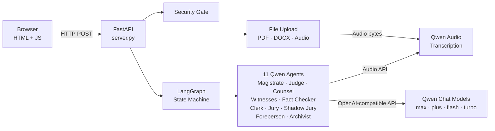

# Architecture

## System Diagram

## Tech Stack

| Layer         | Technology             | Purpose                                        |
| ------------- | ---------------------- | ---------------------------------------------- |
| LLM           | Qwen Cloud (DashScope) | All generative and reasoning tasks             |
| Audio         | Qwen Omni / Qwen Audio | Speech-to-text transcription, TTS              |
| Orchestration | LangGraph (Python)     | 15-node state machine with conditional routing |
| Backend       | FastAPI + Uvicorn      | HTTP API server                                |
| Frontend      | Vanilla HTML/CSS/JS    | Single-page application                        |
| File Parsing  | pypdf, python-docx     | PDF and DOCX extraction                        |
| Charts        | Plotly.js              | Verdict gauge, evidence visualisation          |

## Agent Roles

| Agent           | Role                                                                                                             | Qwen Model                    |
| --------------- | ---------------------------------------------------------------------------------------------------------------- | ----------------------------- |
| Magistrate      | Analyses the case file, asks strategic pre-trial clarifying questions, identifies missing evidence and witnesses | `qwen-max`                    |
| Judge           | Rules on objections per the selected jurisdiction's evidence code, instructs the jury on the law                 | `qwen-max`                    |
| Prosecutor      | Presents evidence, examines witnesses, builds the case against the defendant                                     | `qwen-plus-latest`            |
| Defence Counsel | Challenges evidence, cross-examines witnesses, defends the accused                                               | `qwen-plus-latest`            |
| Witnesses       | Role-play agents strictly bounded to their deposition facts                                                      | `qwen-flash`                  |
| Fact Checker    | Intercepts speculative statements and forces witnesses to stay within the record                                 | `qwen-plus-latest`            |
| Clerk           | Compresses trial history into fact sheets to prevent context overflow                                            | `qwen-flash`                  |
| Jury Foreperson | Leads deliberation, manages voting rounds, detects hung juries after three rounds                                | `qwen-plus-latest`            |
| Jury Panel      | 6-15 diverse jurors deliberating and voting, using varied Qwen models for diverse perspectives                   | Random across all four models |
| Shadow Juries   | 5-50 independent juries evaluating evidence separately to compute a win-probability                              | Random across all four models |
| Archivist       | Logs key rulings and final outcomes for future case reference                                                    | `qwen-turbo-latest`           |

## Trial Phases

The LangGraph state machine routes the trial through 12 phases:

1. **Security Check** — Prompt injection detection
2. **Magistrate Review** — Case analysis and clarifying questions
3. **Discovery** — Evidence disclosure by both sides
4. **Pre-Trial Motions** — Admissibility arguments, summary judgment
5. **Opening Statements** — Prosecution and defence present their cases
6. **Evidence Presentation** — Exhibits submitted, objections ruled upon
7. **Witness Examination** — Direct, cross, redirect, fact-checked statements
8. **Rebuttal** — Counter-evidence and surrebuttal
9. **Closing Arguments** — Final appeals to the jury
10. **Jury Instructions** — Judge explains the applicable law
11. **Jury Deliberation** — Juror discussion, voting rounds, unanimous verdict
12. **Shadow Jury & Verdict** — Parallel jury analysis, win-probability calculation, final verdict and sentencing

## Jurisdiction System

The simulation adapts procedure, evidence rules, and legal standards to the selected jurisdiction. Sixteen jurisdictions are supported, spanning:

- **Common Law (Adversarial):** United Kingdom, United States, Nigeria, Canada, Australia, India, Kenya, Ireland
- **Civil Law (Inquisitorial):** France, Germany, Japan, Brazil
- **Mixed / Custom:** South Africa, International Criminal Court

Each jurisdiction specifies its procedure type, criminal and civil standards of proof, evidence rules, whether a jury is used, whether cross-examination is permitted, and the proper form of address for the presiding judge.
